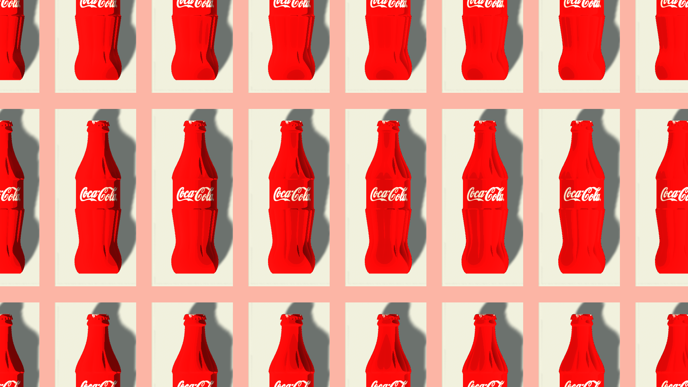
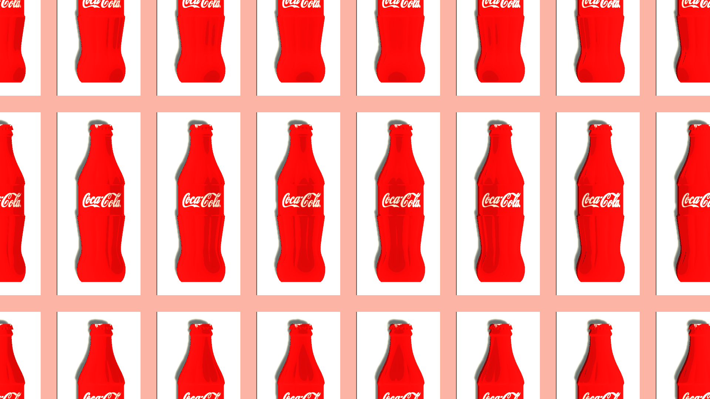

# Final image competition: cel shading

## Introduction

In CSC418, the topic I am interested the most is the shader part. As a video game fan, I realized how shader could play an important role in the visual. After studying the basic shader knowledge with GLSL, I plan to create some decent effect with shader written by my own. In detail, I would like to try to create an effect of the latest Zelda game -- Breath of the wild, especially how their characters looks. Please refer to the image I 

All characters in the game are with really sharp texture and simple shadow, either bright or shaded and the overall tone has a bright color. These combined together create a really gorgerous cartoonic style. After some research, I found the visual effect is closest to the terminology called cel shading or toon shading. 

## Cel shading (https://en.wikipedia.org/wiki/Cel_shading)

Cel shading is actually a type of non-photorealistic rendering technique, which uses less shading color instead of a shade gradient or tints and shades. On a more technical side, a typical cel shading is achieved three main components: shade, outlines and glowing rim. Shade part is done by comparing the light direction and surface normal's direction. If the relative consine is smaller than certain threshold we get a brighter and if the angle between two directions are quite large we get a shade. The outline could be done by postprocessed with edge detection techniques such as sobel filter. Lastly, the rim is added depends on how close it is to the edge and the relative position of it with 

Some relative works I referred are:
https://raulreyesfinalproject.files.wordpress.com/2012/12/dissertation_cell-shading-raul_reyes_luque.pdf - gave me a lot of conceptual overview for cel shading

https://www.shadertoy.com/view/ll33Wn - Example of how it is being implemented in glsl 

http://gad.qq.com/article/detail/26461 - Some reference on unity shader language

## Environment - Unity Game Engine

In order to focus on the shader part rather than build everything from scratch, **I used Unity game engine to help me deal with all other things except shader. That is to say, only the cel_shader.shader and lightchange.cs files is my delta work, other things are mostly build with the resources I already have.** Unity is a professional game engine which could handle almost all aspects relate to the game. With the help of unity, I could import the model and build the scene really quickly and decently as this is not my focus. I could also write some scripts to move the camera based on user's input, so that the demo is more interactive. Lastly, **Unity has its own shader programming language called "ShaderLab" and the actual shader code is written in a variant of CG / HLSL language.** This enables me to customize the shader to the effect I would like to use.

## Syntax of the "shaderLab" programming language

Original source: https://docs.unity3d.com/Manual/SL-Shader.html
Although I had some expierence on shader language while doing Assignment 6. Unity's shaderlab programming  part is still new to me. Here are some notes containing important components of the shaderlab language when I studied its programming. Unity provides complete manual on all of its API, I also searched a lot of tutorials online:

<pre>
In unity -> shader ->  root command of a shader file. Each file must define one (and only one) Shader. It specifies how any objects whose material uses this shader are rendered.
	surface shader -> vertex plus fragment shader
	image effect shader -> more close to full screen effect

Shader structure:

Shader
	property -> claims public variables which can be modified in visualized editor in Unity. We could put key variables that would change the output in property to update the result easily.
	subshader -> container of the actual code of the shader written in Cg/ HLSL
		pass ->  contains a list of render state setup commands
		pass
	subshader
		…
	subshader
		…
	fallback
</pre>

## Demo

I downloaded several models from https://www.turbosquid.com/Search/3D-Models/free to make my scene. The models I downloaded are completely free and does not have potent concerns. The idea of the demo is to mimic one of my favorite artist Andy Warhol's artwork [Campbell's Soup Cans](https://en.wikipedia.org/wiki/Campbell%27s_Soup_Cans) with coke bottle instead of campbell's can (since I cannot find the model of campbell's soup). Then I write some simple scripts to control the rotation of light with time since changing light direction could show my shader work more obviously.

## Submission

The final output is a short animation showing the cel shader and rotation of light. I attach two screenshots and one comparison for statis image and gif for demonstration.

I also include the whole unity project inside for people to reproduce my work, and all codes I wrote explicitly for the project, which are `CelShader.shader` and `lightChange.cs`.
